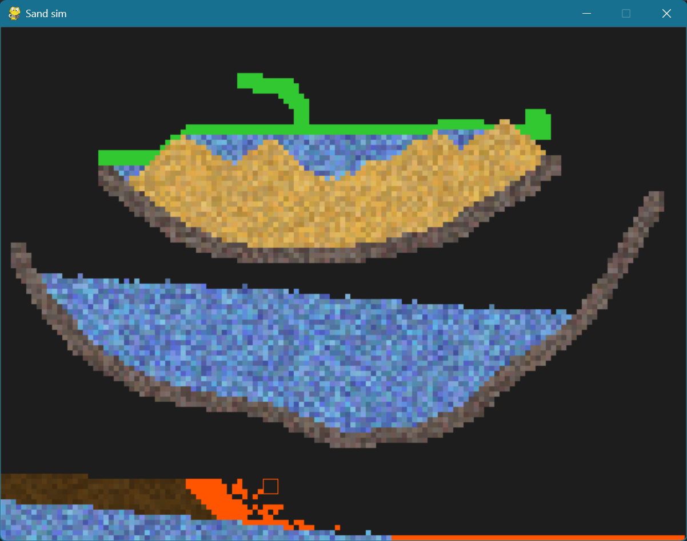

# Particle Simulation Sandbox



A dynamic 2D particle simulation sandbox built with Python and Pygame. This project models the behavior of various elements and their interactions in a grid-based environment, allowing users to experiment with physics in a digital sandbox.

---

## About The Project

This simulation provides a canvas where different types of particles can be introduced and observed. Each particle type follows a unique set of rules, governing its movement and interaction with other particles. The simulation loop continuously updates the state of each particle, creating emergent behaviors and complex patterns from simple rules. It serves as an excellent demonstration of cellular automata and agent-based modeling principles.

---

## Features

* **Grid-Based Physics:** All interactions occur on a 2D grid, where each cell can contain a single particle.
* **Multiple Particle Types:** A diverse set of elements to experiment with:
    * **Sand:** A classic granular particle that falls and stacks up.
    * **Water:** A fluid particle that falls and flows horizontally.
    * **Rock:** A static, immovable solid particle.
    * **Fire:** A volatile element that has a limited lifespan and can ignite other flammable materials.
    * **Oil:** A viscous fluid that floats on water and is flammable.
    * **Gas:** A light element that rises upwards.
    * **Plant:** A lifeform that can grow and spread when in contact with water.
* **Interactive Brush:** Place or erase particles using a mouse-controlled brush of adjustable size.
* **Dynamic Interactions:** Observe how different elements interact, such as fire burning oil, plants growing with water, and oil floating on water.

---

## Getting Started

To get a local copy up and running, follow these simple steps.

### Prerequisites

Ensure you have Python installed on your system. You will also need the Pygame library.

* **Python 3.x**
* **Pygame**
    ```sh
    pip install pygame
    ```

### Installation

1.  Clone the repository to your local machine:
    ```sh
    git clone [https://github.com/your_username/your_repository_name.git](https://github.com/your_username/your_repository_name.git)
    ```
2.  Navigate to the project directory:
    ```sh
    cd your_repository_name
    ```
3.  Run the main application file:
    ```sh
    python main.py
    ```

---

## Usage & Controls

Interact with the simulation using both the mouse and keyboard.

### Mouse Controls

* **Left-Click and Drag:** Hold and move the mouse to draw particles onto the canvas using the selected brush.

### Keyboard Controls

* **Particle Selection:** Press the corresponding key to switch the active particle type for the brush.
    * `S` - Sand
    * `W` - Water
    * `R` - Rock
    * `F` - Fire
    * `O` - Oil
    * `G` - Gas
    * `P` - Plant
* **Eraser:**
    * `E` - Switch to Eraser mode to remove particles.
* **Simulation Control:**
    * `SPACE` - Clear the entire canvas and restart the simulation.

---

## Project Structure

The project is organized into several Python files, each with a specific responsibility:

* `main.py`: The main entry point of the application. It contains the primary game loop, handles window creation, and manages user input.
* `simulation.py`: The core simulation engine. It manages the grid, particle updates, brush controls, and drawing operations.
* `grid.py`: Defines the `Grid` class, which is responsible for managing the 2D array of cells and the particles within them.
* `particle.py`: Contains the class definitions for all particle types (`SandParticle`, `WaterParticle`, etc.), defining their unique colors and update logic.

---

## Contributing

Contributions are what make the open-source community such an amazing place to learn, inspire, and create. Any contributions you make are **greatly appreciated**.

If you have a suggestion that would make this better, please fork the repo and create a pull request. You can also simply open an issue with the tag "enhancement".

1.  Fork the Project
2.  Create your Feature Branch (`git checkout -b feature/AmazingFeature`)
3.  Commit your Changes (`git commit -m 'Add some AmazingFeature'`)
4.  Push to the Branch (`git push origin feature/AmazingFeature`)
5.  Open a Pull Request

---

## License

Distributed under the MIT License. See `LICENSE.txt` for more information. (Note: You will need to add a LICENSE.txt file to your repository).

---

## Acknowledgments

* This project was built using the [Pygame](https://www.pygame.org/) library.
* Inspiration from various "falling sand" games and physics sandboxes.

